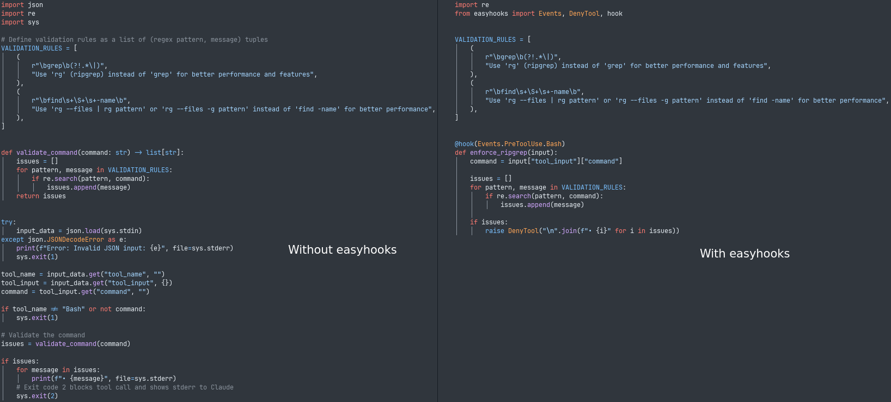

# Claude Code Easyhooks


[](https://pypi.python.org/pypi/claude-code-easyhooks)

[](https://codecov.io/gh/lucasrcezimbra/claude-code-easyhooks)

[](https://claude-code-easyhooks.readthedocs.io/en/latest/?version=latest)

Micro-framework to create hooks for Claude Code




* Documentation: https://claude-code-easyhooks.readthedocs.io.


## How to use

1. Install:
```bash
pip install claude-code-easyhooks
# or
pipx install claude-code-easyhooks
# or
uvx claude-code-easyhooks
```

2. Add this config to your `.claude/settings.json`:
```json
{
  "hooks": {
    "PreToolUse": [
      {
        "hooks": [
          {
            "command": "claude-code-easyhooks",
            "type": "command"
          }
        ],
        "matcher": "*"
      }
    ]
  }
}
```

3. Create your easyhooks in `$HOME/.claude/easyhooks/`. All `.py` files inside this directory will be loaded as easyhooks. Check out some [examples](https://github.com/lucasrcezimbra/claude-code-easyhooks/tree/master/examples).


## Configuration

### Environment Variables

- **`CC_EASYHOOKS_LOG_LEVEL`**: Set the logging level (default: `INFO`). Valid values: `DEBUG`, `INFO`, `WARNING`, `ERROR`, `CRITICAL`.
- **`CC_EASYHOOKS_LOG_FILE`**: Set the log file path (default: `<tempdir>/easyhooks.log`). On Linux/Mac this is typically `/tmp/easyhooks.log`, on Windows `C:\Users\<user>\AppData\Local\Temp\easyhooks.log`.

Example:
```bash
export CC_EASYHOOKS_LOG_LEVEL=DEBUG
export CC_EASYHOOKS_LOG_FILE=$HOME/.claude/easyhooks/easyhooks.log
```


## Contributing

Contributions are welcome, feel free to open an Issue or Pull Request.

```
git clone https://github.com/lucasrcezimbra/claude-code-easyhooks
cd claude-code-easyhooks
make install
make test
```

### Keeping Up with Template Changes

This project was generated using [cookiecutter-pypackage](https://github.com/lucasrcezimbra/cookiecutter-pypackage). To update the project with the latest template changes, you can use [cruft](https://cruft.github.io/cruft/):

```bash
make update-template
```

After running `make update-template`, review the changes and resolve any conflicts that may arise.
